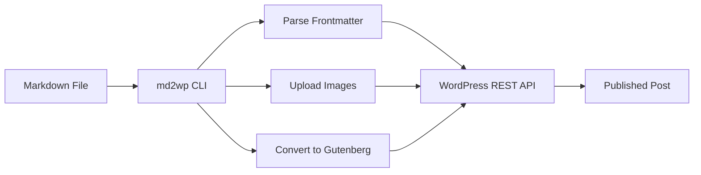

# What is md2wp?

md2wp is a TypeScript CLI tool and library that lets you publish markdown files directly to WordPress with automatic Gutenberg block conversion and intelligent image management.

## Why md2wp?

Writing blog posts in WordPress can be tedious. Markdown is simpler, portable, and version-control friendly. md2wp bridges the gap:

- ✅ **Write locally** in your favorite markdown editor
- ✅ **Version control** your posts with Git
- ✅ **Automatic images** uploaded and cached
- ✅ **Gutenberg blocks** for native WordPress editing
- ✅ **Frontmatter** for metadata (tags, categories, status)

## How It Works



1. **Parse** - Reads your markdown file and extracts frontmatter
2. **Upload Images** - Finds local images, uploads to WordPress Media Library
3. **Transform** - Converts markdown to Gutenberg block HTML format
4. **Publish** - Sends to WordPress REST API using Application Passwords
5. **Cache** - Remembers uploaded images to avoid duplicates
6. **Update** - Writes WordPress post ID back to your markdown file

## Key Features

### Gutenberg Block Conversion

Unlike tools that convert markdown to plain HTML, md2wp creates proper **Gutenberg blocks**:

```html
<!-- wp:heading {"level":1} -->
<h1 class="wp-block-heading">My Heading</h1>
<!-- /wp:heading -->

<!-- wp:paragraph -->
<p>This is a paragraph with <strong>bold</strong> text.</p>
<!-- /wp:paragraph -->
```

This means:
- WordPress recognizes your content as native blocks
- Full editing capabilities in Gutenberg editor
- Automatic responsive images with srcsets
- Future-proof as WordPress evolves

### Smart Image Caching

Images are hashed (SHA-256) and cached locally:
- Upload once, reuse forever
- Prevents duplicate uploads
- Verifies media still exists before reusing
- Cache stored in `.md2wp/cache.json`

### Frontmatter-Driven

All post metadata lives in YAML frontmatter:

```yaml
---
title: "Required: Post Title"
slug: optional-url-slug
status: draft | publish
tags: [tag1, tag2]
categories: [category1]
excerpt: "Post excerpt"
date: 2024-01-15
---
```

After publishing, md2wp adds WordPress details:

```yaml
wp_post_id: 123
wp_url: https://site.com/post/
wp_modified: 2024-01-15T10:30:00Z
```

## Use Cases

### Content Writers
- Write posts in markdown
- Preview locally with any markdown viewer
- Publish to WordPress when ready
- Version control your content

### Developers
- Automate content publishing in CI/CD
- Bulk publish documentation to WordPress
- Integrate WordPress publishing into custom workflows
- Use as a library in Node.js applications

### Teams
- Collaborate on posts using Git
- Review content via pull requests
- Maintain content history
- Separate writing from publishing

## What's Supported

### Markdown Features (v1.0)
- ✅ Headings (H1-H6)
- ✅ Paragraphs
- ✅ Lists (ordered & unordered)
- ✅ Images (local file upload)
- ✅ Links
- ✅ Bold/italic/inline code
- ✅ Code blocks with syntax highlighting
- ✅ Blockquotes
- ✅ Horizontal rules

### Coming Soon
- 🚧 Tables (v1.2.0)
- 🚧 Task lists (v1.2.0)
- 🚧 Footnotes (v1.2.0)
- 🚧 Update existing posts (v1.3.0)
- 🚧 Featured images (v1.4.0)

## Architecture

md2wp is a TypeScript monorepo with:

- **@md2wp/core** - Core library (can be used standalone)
- **@md2wp/cli** - Command-line interface
- **@md2wp/vscode** - VS Code extension (planned)

Built with:
- **TypeScript** - Type-safe development
- **unified/remark** - Markdown parsing and transformation
- **gray-matter** - Frontmatter extraction
- **WordPress REST API** - Publishing posts and media

## Next Steps

Ready to try md2wp?

- [Installation Guide →](/guide/installation)
- [Getting Started →](/guide/getting-started)
- [View on GitHub →](https://github.com/nickhart/md2wp)
